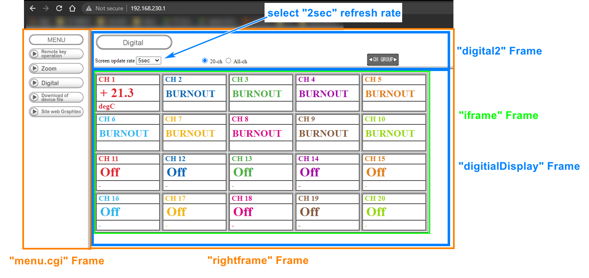

# Graphtec Web Scraper

This script will be able to scrape temperature data from Graphtec's local web service. Graphtec does not support data transfer via serial communication for Linux systems. Instead by plugging an ethernet cable to a raspberry pi, real-time (2 sec delay) temperature data can be scraped.

## How does it work?

The default IP iddress via ethernet is http://169.254.0.1

(Note: The figures below have a different URL because I was testing via wifi adapter).

When the IP address is entered, a html page is returned, as shown in Figure 1. The graphtec can actually be remotely controlled through this web UI. `Selenium` and `BeautifulSoup` are Python packages that enable web scraping. `Selenium` simulates web browser navigation and `BeautifulSoup` is an extremely user-friendly HTML parser.

**Figure 1. Default Screen**
{width=300}

The webpage is dynamically generated (the URL doesn't change) where views can be changed based on menu options. In order to dynamically change the view, the webpage is constructed of `frames`.

**Order of Operations:**

1. Change display to show temperatures

   The first step is to change the `rightframe` Frame to show channel temperatures. This can be done by pressing the `Digital` button in the `menu.cgi` Frame. The result should look like Figure 2.

2. Change time interval update

   The second step is change the time interval refresh rate from 5 sec to 2 sec (the fastest available).This can be done by selected `2sec` from the drop down in the `rightframe` -> `digital2` Frame.

3. Extract data

   The last step is to extract the temperature data. All the channel temperature data are logged in an HTML table structure in the `rightframe` -> `digitalDispaly` Frame.

**Figure 2. Display Screen**
{width=300}
